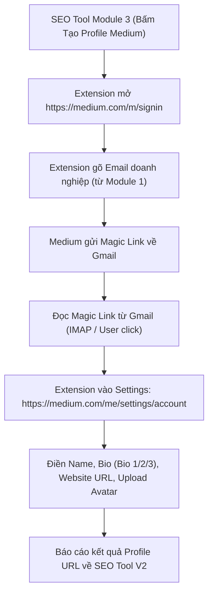

# 📗 MEDIUM — TÀI NGUYÊN & CẤU TRÚC TỰ ĐỘNG HÓA (AUTOMATION SCHEMA)

Tài liệu này chứa toàn bộ cấu trúc selectors, luồng điền form và cấu hình JSON cho **Medium.com** do AI nghiên cứu và bóc tách.

---

## 1. Luồng Tự Động Hóa Medium (Automation Flow)



---

## 2. Bản Cấu Hình JSON Schema Chuẩn Cho Medium (`medium_schema.json`)

```json
{
  "platform": "medium",
  "name": "Medium.com",
  "urls": {
    "login_email": "https://medium.com/m/signin",
    "settings_account": "https://medium.com/me/settings/account",
    "settings_design": "https://medium.com/me/settings/design"
  },
  "steps": [
    {
      "step_id": 1,
      "name": "Nhập Email đăng ký",
      "target_url": "https://medium.com/m/signin",
      "actions": [
        { "type": "wait", "selector": "a[href*='email'], button", "timeout": 10000 },
        { "type": "click", "selector": "a[href*='email']" },
        { "type": "wait", "selector": "input[type='email']", "timeout": 10000 },
        { "type": "type", "selector": "input[type='email']", "field": "email" },
        { "type": "click", "selector": "button[type='submit']" }
      ]
    },
    {
      "step_id": 2,
      "name": "Cập nhật Profile Doanh nghiệp",
      "target_url": "https://medium.com/me/settings/account",
      "actions": [
        { "type": "wait", "selector": "input[name='name'], [data-testid='usernameInput']", "timeout": 10000 },
        { "type": "type", "selector": "input[name='name']", "field": "brand" },
        { "type": "type", "selector": "textarea[name='bio']", "field": "bio1" },
        { "type": "type", "selector": "input[name='website']", "field": "website" },
        { "type": "upload", "selector": "input[type='file']", "field": "logo" }
      ]
    }
  ]
}
```

---

## 3. Ghi Chú Kỹ Thuật

- **Dữ liệu đầu vào lấy từ Module 1 (`business_info`):**
  - `field: email` -> Email đại diện / Email cài đặt.
  - `field: brand` -> Tên thương hiệu / Công ty (`biz.brand` / `biz.company_name`).
  - `field: bio1` -> Đoạn Bio 1 (`biz.bio1`).
  - `field: website` -> URL Website (`biz.website`).
