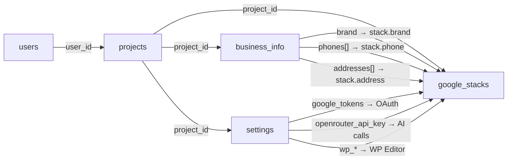

# 📊 DATA REGISTRY — Bản đồ Dữ liệu & ID

> **Cập nhật lần cuối:** 2026-07-25
> **Database:** SQLite (`backend/seo_tool.db`)
> **Schema file:** `backend/db.js`
> **Mục đích:** AI đọc file này để biết data/ID nào đã tồn tại, ở table nào, kiểu gì.
> **Quy tắc:** Mỗi khi thêm/xóa/đổi column hoặc table → BẮT BUỘC cập nhật file này.

---

## Database Schema

### Table: `users`

| Column | Type | Constraint | Mô tả |
|--------|------|-----------|-------|
| `id` | INTEGER | PRIMARY KEY AUTOINCREMENT | ID người dùng (auto-generated) |
| `name` | TEXT | NOT NULL | Tên hiển thị |
| `avatar` | TEXT | — | URL avatar (Dicebear SVG) |

**Quan hệ:** `users.id` → được tham chiếu bởi `projects.user_id`

---

### Table: `projects`

| Column | Type | Constraint | Mô tả |
|--------|------|-----------|-------|
| `id` | INTEGER | PRIMARY KEY AUTOINCREMENT | ID dự án (auto-generated) |
| `user_id` | INTEGER | FOREIGN KEY → `users.id` | Thuộc user nào |
| `name` | TEXT | NOT NULL | Tên dự án |
| `description` | TEXT | — | Mô tả dự án |
| `created_at` | DATETIME | DEFAULT CURRENT_TIMESTAMP | Ngày tạo |

**Quan hệ:** `projects.id` → được tham chiếu bởi `settings`, `business_info`, `google_stacks`

---

### Table: `settings`

| Column | Type | Constraint | Mô tả |
|--------|------|-----------|-------|
| `project_id` | INTEGER | PRIMARY KEY (composite) + FK → `projects.id` ON DELETE CASCADE | Thuộc project nào |
| `key` | TEXT | PRIMARY KEY (composite) | Tên setting |
| `value` | TEXT | — | Giá trị setting |

**Các key đã dùng:**
| Key | Mô tả | Module |
|-----|--------|--------|
| `openrouter_api_key` | API key cho OpenRouter LLM | Settings |
| `google_client_id` | Google OAuth Client ID | Settings |
| `google_client_secret` | Google OAuth Client Secret | Settings |
| `google_redirect_uri` | Google OAuth Redirect URI | Settings |
| `google_tokens` | JSON string chứa access/refresh tokens | Google OAuth |
| `wp_domain` | WordPress domain URL | Settings |
| `wp_username` | WordPress username | Settings |
| `wp_app_password` | WordPress application password | Settings |

---

### Table: `business_info`

| Column | Type | Constraint | Mô tả | Entity ID |
|--------|------|-----------|-------|-----------|
| `project_id` | INTEGER | PRIMARY KEY + FK → `projects.id` ON DELETE CASCADE | Thuộc project nào | — |
| `website` | TEXT | — | URL website | `biz.website` |
| `brand` | TEXT | — | Tên thương hiệu | `biz.brand` |
| `company_name` | TEXT | — | Tên công ty đầy đủ | `biz.company_name` |
| `founded_date` | TEXT | — | Ngày thành lập | `biz.founded_date` |
| `owner` | TEXT | — | Người đại diện | `biz.owner` |
| `tax_code` | TEXT | — | Mã số thuế | `biz.tax_code` |
| `industry` | TEXT | — | Ngành nghề | `biz.industry` |
| `products` | TEXT | — | Sản phẩm/Dịch vụ | `biz.products` |
| `features` | TEXT | — | Tính năng/Đặc điểm | `biz.features` |
| `employees` | TEXT | — | Số lượng nhân sự | `biz.employees` |
| `activity_area` | TEXT | — | Phạm vi hoạt động | `biz.activity_area` |
| `usp` | TEXT | — | Unique Selling Point | `biz.usp` |
| `achievements` | TEXT | — | Thành tựu | `biz.achievements` |
| `certificates` | TEXT | — | Chứng chỉ/Chứng nhận | `biz.certificates` |
| `search_id` | TEXT | — | Search Entity ID | `biz.search_id` |
| `phones` | TEXT | — | JSON Array: DS số điện thoại | `biz.phones[]` |
| `addresses` | TEXT | — | JSON Array: DS địa chỉ | `biz.addresses[]` |
| `nap` | TEXT | — | Name-Address-Phone string | `biz.nap` |
| `bio1` | TEXT | — | Bio đoạn 1 (HTML from WPEditor) | `biz.bio1` |
| `bio2` | TEXT | — | Bio đoạn 2 (HTML from WPEditor) | `biz.bio2` |
| `bio3` | TEXT | — | Bio đoạn 3 (HTML from WPEditor) | `biz.bio3` |

**Dữ liệu JSON trong column `phones`:**
```json
["0123456789", "0987654321"]
```

**Dữ liệu JSON trong column `addresses`:**
```json
[
  { "address": "123 Đường ABC, Quận 1, TP.HCM", "map_url": "https://maps.google.com/...", "lat": "10.762", "lng": "106.660" },
  { "address": "456 Đường XYZ, Quận 2, TP.HCM", "map_url": "https://maps.google.com/...", "lat": "", "lng": "" }
]
```
> **Migration:** Nếu data cũ là `string[]`, `ProjectDataContext.jsx` tự chuyển thành `object[]` khi load.

---

### Table: `google_stacks`

| Column | Type | Constraint | Mô tả | Entity ID |
|--------|------|-----------|-------|-----------|
| `id` | INTEGER | PRIMARY KEY AUTOINCREMENT | ID stack (auto-generated) | `stack.id` |
| `project_id` | INTEGER | NOT NULL + FK → `projects.id` ON DELETE CASCADE | Thuộc project nào | — |
| `url` | TEXT | NOT NULL | URL chính của stack | `stack.url` |
| `brand` | TEXT | NOT NULL | Brand (auto-fill từ business_info) | `stack.brand` |
| `main_key` | TEXT | NOT NULL | Từ khóa chính | `stack.main_key` |
| `drive_folder` | TEXT | NOT NULL | Tên Drive folder | `stack.drive_folder` |
| `created_at` | DATETIME | DEFAULT CURRENT_TIMESTAMP | Ngày tạo | — |
| `keywords` | TEXT | — | JSON: 39 keyword fields | `stack.keywords.*` |
| `assets` | TEXT | — | JSON: Google Drive assets (IDs, URLs) | `stack.assets.*` |
| `step4_data` | TEXT | — | JSON: Step 4 Mới (9 Sections: 1.1-1.3 Upload files, 2. My Maps, 3. Site view, 4. GMB, 5. Youtube, 6. Twitter, 7. Pinterest, 7-Custom. Mạng xã hội tùy chọn nhập tên tự do, 8. Drawing edit link, 9. Calendar, 11. Pearltree) | `stack.step4.*` |
| `step4_images` | TEXT | — | JSON: Step 4 uploaded images | `stack.step4_images[]` |
| `sheet_created_url` | TEXT | — | URL Google Sheet đã tạo | `stack.sheet_url` |
| `image_folder_url` | TEXT | — | URL folder chứa images trên Drive | `stack.image_folder_url` |
| `optimize_results` | TEXT | — | JSON: Kết quả optimize Docs | `stack.optimize.docs` |
| `pdf_results` | TEXT | — | JSON: Kết quả optimize PDF | `stack.optimize.pdf` |
| `button3_results` | TEXT | — | JSON: Kết quả optimize Sheet | `stack.optimize.sheet` |
| `phone` | TEXT | — | SĐT chọn từ business_info | `stack.phone` |
| `address` | TEXT | — | Địa chỉ chọn từ business_info | `stack.address` |
| `languages_data` | TEXT | — | JSON: Dữ liệu 15 ngôn ngữ đã dịch | `stack.languages.*` |
| `languages_opt_results` | TEXT | — | JSON: Kết quả optimize assets ngôn ngữ | `stack.languages_opt.*` |
| `prep_checks` | TEXT | — | JSON: Trạng thái checkboxes PrepCheck `{ image, schema, nap, map, keywords }` | `stack.prep_checks` |
| `google_map_url` | TEXT | — | URL Google Map nhập thủ công | `stack.google_map_url` |
| `manual_video_done` | INTEGER | DEFAULT 0 | Đã tải video thủ công (0/1) | `stack.manual_video_done` |

**Dữ liệu JSON trong column `keywords`:**
```json
{
  "key_chinh_local": "từ khóa chính + địa phương",
  "lsi_local": "LSI + local",
  "lsi_1": "LSI keyword 1",
  "lsi_2": "LSI keyword 2",
  "lsi_3": "LSI keyword 3",
  "lsi_4": "LSI keyword 4",
  "cluster_1": "Cluster keyword 1",
  "cluster_2": "...",
  "cluster_3": "...",
  "cluster_4": "...",
  "cluster_5": "...",
  "cluster_6": "...",
  "lsi_5": "LSI keyword 5",
  "...": "... (đến lsi_41)"
}
```
> Tổng cộng 39 fields, chia 4 nhóm — xem chi tiết tại `frontend/src/constants/keywordFields.js`

**Dữ liệu JSON trong column `assets`:**
```json
{
  "folderId": "Google Drive folder ID",
  "folderUrl": "https://drive.google.com/...",
  "sheetId": "Google Sheet ID",
  "sheetUrl": "https://docs.google.com/spreadsheets/...",
  "docs": [
    { "id": "doc ID", "name": "doc name", "url": "..." }
  ]
}
```

---

### Table: `social_schemas`

| Column | Type | Constraint | Mô tả |
|--------|------|-----------|-------|
| `id` | INTEGER | PRIMARY KEY AUTOINCREMENT | ID schema |
| `platform` | TEXT | UNIQUE NOT NULL | Tên nền tảng (medium, reddit, quora...) |
| `name` | TEXT | NOT NULL | Tên hiển thị (Medium.com, Reddit.com...) |
| `schema_json` | TEXT | NOT NULL | Cấu hình JSON Selectors & các bước thực thi |
| `created_at` | DATETIME | DEFAULT CURRENT_TIMESTAMP | Ngày tạo |

---

### Table: `social_profiles`

| Column | Type | Constraint | Mô tả |
|--------|------|-----------|-------|
| `id` | INTEGER | PRIMARY KEY AUTOINCREMENT | ID profile task |
| `project_id` | INTEGER | NOT NULL + FK → `projects.id` ON DELETE CASCADE | Thuộc project nào |
| `platform` | TEXT | NOT NULL | Nền tảng social |
| `status` | TEXT | DEFAULT 'pending' | Trạng thái (`pending`, `in_progress`, `completed`, `failed`) |
| `profile_url` | TEXT | — | URL profile sau khi tạo thành công |
| `logs` | TEXT | — | Log thực thi chi tiết từ Chrome Extension |
| `created_at` | DATETIME | DEFAULT CURRENT_TIMESTAMP | Ngày tạo |
| `updated_at` | DATETIME | DEFAULT CURRENT_TIMESTAMP | Cập nhật gần nhất |

---

### Table: `system_tasks`

| Column | Type | Constraint | Mô tả |
|--------|------|-----------|-------|
| `id` | INTEGER | PRIMARY KEY AUTOINCREMENT | ID task duy nhất trong toàn hệ thống |
| `project_id` | INTEGER | NOT NULL + FK → `projects.id` ON DELETE CASCADE | Thuộc project nào |
| `module_type` | TEXT | NOT NULL | Loại module tác vụ (`profile_creation`, `indexing`, `pbn_post`...) |
| `task_name` | TEXT | NOT NULL | Tên hiển thị công việc |
| `payload` | TEXT | — | JSON string chứa dữ liệu đầu vào |
| `schema_steps` | TEXT | — | JSON string chứa các bước kịch bản thao tác web |
| `status` | TEXT | DEFAULT 'pending' | Trạng thái (`pending`, `in_progress`, `completed`, `failed`) |
| `retry_count` | INTEGER | DEFAULT 0 | Số lần đã tự động thử lại khi lỗi |
| `max_retries` | INTEGER | DEFAULT 3 | Số lần thử lại tối đa cho phép |
| `result_data` | TEXT | — | JSON string dữ liệu kết quả sau thực thi |
| `logs` | TEXT | — | Terminal logs quá trình thực thi từ Worker Agent |
| `created_at` | DATETIME | DEFAULT CURRENT_TIMESTAMP | Ngày tạo |
| `updated_at` | DATETIME | DEFAULT CURRENT_TIMESTAMP | Cập nhật gần nhất |

---

### Table: `indexing_logs`

| Column | Type | Constraint | Mô tả |
|--------|------|-----------|-------|
| `id` | INTEGER | PRIMARY KEY AUTOINCREMENT | ID log |
| `project_id` | INTEGER | NOT NULL + FK → `projects.id` ON DELETE CASCADE | Thuộc project nào |
| `url` | TEXT | NOT NULL | URL đã gửi yêu cầu lập chỉ mục |
| `service` | TEXT | NOT NULL | Công cụ (`google`, `bing`) |
| `status` | TEXT | DEFAULT 'pending' | Trạng thái (`success`, `failed`, `pending`) |
| `response_msg` | TEXT | — | Thông báo chi tiết từ API |
| `submitted_at` | DATETIME | DEFAULT CURRENT_TIMESTAMP | Thời gian submit |

---

### Table: `pbn_sites`

| Column | Type | Constraint | Mô tả |
|--------|------|-----------|-------|
| `id` | INTEGER | PRIMARY KEY AUTOINCREMENT | ID site PBN |
| `project_id` | INTEGER | NOT NULL + FK → `projects.id` ON DELETE CASCADE | Thuộc project nào |
| `site_name` | TEXT | NOT NULL | Tên brand/nhận diện site PBN |
| `site_url` | TEXT | NOT NULL | URL website WordPress |
| `username` | TEXT | NOT NULL | Username đăng nhập WordPress |
| `app_password` | TEXT | NOT NULL | Application Password cấp từ WordPress |
| `status` | TEXT | DEFAULT 'active' | Trạng thái hoạt động |
| `created_at` | DATETIME | DEFAULT CURRENT_TIMESTAMP | Thời gian khởi tạo |

---

### Table: `social_pbn_posts`

| Column | Type | Constraint | Mô tả |
|--------|------|-----------|-------|
| `id` | INTEGER | PRIMARY KEY AUTOINCREMENT | ID log bài đăng |
| `project_id` | INTEGER | NOT NULL + FK → `projects.id` ON DELETE CASCADE | Thuộc project nào |
| `target_type` | TEXT | NOT NULL | Loai trang đích (`wordpress` hoặc `social_extension`) |
| `target_name` | TEXT | NOT NULL | Tên PBN site hoặc tên MXH |
| `target_url` | TEXT | — | URL trang đích |
| `post_title` | TEXT | NOT NULL | Tiêu đề bài viết xuất bản |
| `post_url` | TEXT | — | URL bài viết đã đăng thành công |
| `status` | TEXT | DEFAULT 'pending' | Trạng thái (`completed`, `failed`, `pending`) |
| `error_message` | TEXT | — | Thông báo lỗi khi thất bại |
| `created_at` | DATETIME | DEFAULT CURRENT_TIMESTAMP | Thời gian đăng bài |

---

## Cross-Module References (Tham chiếu chéo)



### Chi tiết tham chiếu:
| Từ | Đến | Cách thức |
|----|-----|-----------|
| `business_info.brand` | `google_stacks.brand` | Auto-fill khi tạo stack mới |
| `business_info.phones[]` | `google_stacks.phone` | User chọn 1 SĐT từ dropdown |
| `business_info.addresses[]` | `google_stacks.address` | User chọn 1 địa chỉ từ dropdown |
| `settings.google_tokens` | Google API calls trong stack | Server đọc tokens để gọi Drive/Docs/Sheets API |
| `settings.openrouter_api_key` | AI optimization trong stack | Server đọc key để gọi OpenRouter LLM |
| `settings.wp_*` | WP Editor trong stack | Frontend dùng để gọi WordPress REST API |

---

## 15 Ngôn ngữ hỗ trợ

| Code | Language | Dùng trong |
|------|----------|-----------|
| `ar` | Arabic | Google Stack translate & lang assets |
| `hi` | Hindi | Google Stack translate & lang assets |
| `ru` | Russian | Google Stack translate & lang assets |
| `zh` | Chinese | Google Stack translate & lang assets |
| `en` | English | Google Stack translate & lang assets |
| `ja` | Japanese | Google Stack translate & lang assets |
| `de` | German | Google Stack translate & lang assets |
| `es` | Spanish | Google Stack translate & lang assets |
| `pt` | Portuguese | Google Stack translate & lang assets |
| `fr` | French | Google Stack translate & lang assets |
| `bn` | Bengali | Google Stack translate & lang assets |
| `pl` | Polish | Google Stack translate & lang assets |
| `fi` | Finnish | Google Stack translate & lang assets |
| `ko` | Korean | Google Stack translate & lang assets |
| `it` | Italian | Google Stack translate & lang assets |

> Xem mapping code → full name tại `frontend/src/constants/keywordFields.js` → `getLanguageFullName()`

---

## Keyword Fields (39 fields, 4 nhóm)

| Nhóm | Fields | Key Pattern | Mô tả |
|------|--------|-------------|-------|
| **Nhóm 1** (2 fields) | `key_chinh_local`, `lsi_local` | — | Key chính + Local, LSI + Local |
| **Nhóm 2** (4 fields) | `lsi_1` → `lsi_4` | `lsi_{1-4}` | LSI keywords 1-4 |
| **Nhóm 3** (6 fields) | `cluster_1` → `cluster_6` | `cluster_{1-6}` | Cluster keywords 1-6 |
| **Nhóm 4** (27 fields) | `lsi_5` → `lsi_41` | `lsi_{5-41}` | LSI keywords 5-41 |

> **Tổng cộng:** 2 + 4 + 6 + 27 = **39 fields** (lưu dạng JSON trong `google_stacks.keywords`)
> **Bulk paste:** Hỗ trợ paste hàng loạt theo từng nhóm
